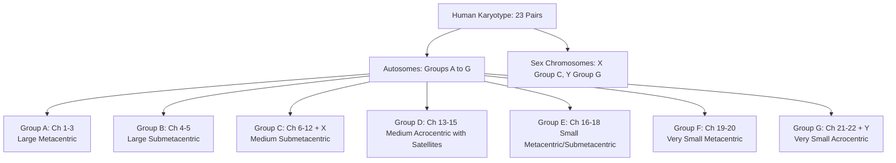

# VALUE ADD: Unit 9.4 - Chromosomes, DNA, and Chromosomal Aberrations
**Date:** June 06, 2026 | **Target:** Chromosomes, DNA, and Chromosomal Aberrations
**Syllabus Mapping:** Unit 9.4

# UPSC ANTHROPOLOGY PAPER I — UNIT 9.4
## Chromosomes and Chromosomal Aberrations in Man

---

## 1. Chromosome Architecture & Classification (The Structural Blueprint)

### A. Morphological Classification of Chromosomes
Chromosomes are classified based on the **centromere position** (primary constriction), which determines the relative lengths of the short arm (**$p$ arm**, *petit*) and the long arm (**$q$ arm**).

```
   [Metacentric]         [Submetacentric]         [Acrocentric]         [Telocentric]
       (p=q)                  (p<q)                  (p<<q)                (No p)
        
        | p                    | p                     o Satellite           
        |                      |                       | p (very small)      
      --o-- Centromere       --o-- Centromere        --o-- Centromere      --o-- Centromere
        |                      |                       |                     |
        | q                    |                       | q                   | q
                               | q                     |                     |
```

| Chromosome Type | Centromere Position | Arm Ratio ($q/p$) | Anaphase Shape | Human Examples |
| :--- | :--- | :--- | :--- | :--- |
| **Metacentric** | Median / Middle | $\approx 1.0$ to $1.2$ | **V-shape** | Chromosomes 1, 3, 16, 19, 20 |
| **Submetacentric** | Sub-median / Off-center | $1.3$ to $3.0$ | **L-shape / J-shape** | Chromosomes 2, 4–12, X, 17, 18 |
| **Acrocentric** | Sub-terminal / Near end | $> 3.0$ (with satellites) | **I-shape / Rod-shape** | Chromosomes 13, 14, 15, 21, 22, Y |
| **Telocentric** | Terminal / At the very tip | $\infty$ | **Rod-shape** | *Absent in normal human karyotype* |

---

### B. The Denver Classification System (1960)
To standardize human cytogenetics, the **Denver Conference** classified the 23 pairs of human chromosomes into **7 distinct groups (A to G)** based on size and centromere position.



---

## 2. Advanced Cytogenetic Techniques for Aberration Detection

To study chromosomal aberrations, physical anthropologists and cytogeneticists use specific staining and molecular techniques:

```
+---------------------------------------------------------------------------------+
|                               CYTOGENETIC TOOLS                                 |
+---------------------------------------------------------------------------------+
|  G-Banding (Giemsa)       --> Standard clinical karyotyping; stains AT-rich     |
|                               regions dark, GC-rich regions light.              |
+---------------------------------------------------------------------------------+
|  Q-Banding (Quinacrine)   --> Fluorescent staining; excellent for identifying   |
|                               the Y chromosome and heteromorphisms.             |
+---------------------------------------------------------------------------------+
|  FISH                     --> Uses fluorescent DNA probes to detect micro-      |
|  (Fluorescence In Situ    --> deletions, duplications, and translocations       |
|   Hybridization)              at high resolution.                               |
+---------------------------------------------------------------------------------+
|  Spectral Karyotyping     --> "Chromosome painting"; colors each chromosome     |
|  (SKY)                    --> with a different fluorophore to map complex       |
|                               rearrangements.                                   |
+---------------------------------------------------------------------------------+
```

---

## 3. Numerical Aberrations: Deep-Dive & Mechanisms

Numerical aberrations occur due to **Non-Disjunction**—the failure of homologous chromosomes (Meiosis I) or sister chromatids (Meiosis II) to separate during cell division.

### A. Meiosis I vs. Meiosis II Non-Disjunction

```
         MEIOSIS I NON-DISJUNCTION                    MEIOSIS II NON-DISJUNCTION
         
               ( O O )  Normal Diploid                      ( O O )  Normal Diploid
                  |                                            |
         [Homologs fail to separate]                  [Normal Meiosis I separation]
               /     \                                      /     \
           (O O)     ( )                                 ( O )   ( O )
           /   \     / \                                 /   \   /   \
         (OO) (OO)  ()  ()                            [Chromatids fail to separate]
          |    |    |   |                              /   \       /   \
         n+1  n+1  n-1 n-1                           (OO)  ( )   (O)   (O)
                                                      |     |     |     |
      [100% Abnormal Gametes]                        n+1   n-1    n     n
                                                    [50% Abnormal, 50% Normal Gametes]
```

---

### B. Comprehensive Clinical-Anthropological Profiles

| Syndrome | Karyotype | Incidence | Key Phenotypic Markers | Anthropological & Evolutionary Significance |
| :--- | :--- | :--- | :--- | :--- |
| **Down Syndrome** | $47, XX/XY, +21$ | $1 \text{ in } 800$ | Epicanthic folds, Simian crease, brushfield spots, hypotonia, brachycephaly. | Strong correlation with **advanced maternal age** (maternal selection hypothesis; decay of meiotic spindle). |
| **Patau Syndrome** | $47, XX/XY, +13$ | $1 \text{ in } 15,000$ | Microcephaly, holoprosencephaly, cleft lip/palate, polydactyly. | High embryonic lethality; provides data on natural selection filtering severe autosomal imbalances. |
| **Edward Syndrome** | $47, XX/XY, +18$ | $1 \text{ in } 6,000$ | Clenched fists with overlapping fingers, rocker-bottom feet, micrognathia. | Severe developmental disruption; survival past 1 year is $< 10\%$. |
| **Turner Syndrome** | $45, X$ | $1 \text{ in } 2,500 \text{ females}$ | Short stature, webbed neck (pterygium colli), shield chest, streak ovaries, coarctation of aorta. | Only viable human monosomy. Demonstrates that two active X chromosomes are essential for normal female ovarian development. |
| **Klinefelter Syndrome** | $47, XXY$ | $1 \text{ in } 1,000 \text{ males}$ | Tall stature, gynecomastia, hypogonadism, azoospermia, feminine fat distribution. | Highlights the role of the **SRY gene** on the Y chromosome in determining male phenotype despite multiple X chromosomes. |
| **Jacob's Syndrome** | $47, XYY$ | $1 \text{ in } 1,000 \text{ males}$ | Tall stature, severe cystic acne in adolescence, normal fertility. | Historically (and erroneously) linked to aggressive behavior/criminality (the "Supermale" myth by Patricia Jacobs, 1965). |

---

## 4. Structural Aberrations: Mechanisms & Evolutionary Significance

Structural aberrations occur when chromosomes break and rejoin abnormally.

```
(A) DELETION (Loss of segment)
    A-B-C-D-E-F  --->  A-B-E-F  (Segment C-D lost)

(B) DUPLICATION (Repetition of segment)
    A-B-C-D-E-F  --->  A-B-C-D-C-D-E-F  (Segment C-D duplicated)

(C) INVERSION (180-degree rotation)
    Paracentric (Excludes Centromere):   A-B-C*D-E-F  --->  A-B-C*E-D-F
    Pericentric (Includes Centromere):   A-B*C-D-E-F  --->  A-E-D-C*B-F   (* = Centromere)

(D) TRANSLOCATION (Interchange between non-homologous chromosomes)
    Reciprocal:          A-B-C-D-E-F  +  W-X-Y-Z  --->  A-B-C-Z  +  W-X-Y-D-E-F
    Robertsonian:        Two acrocentric chromosomes fuse at centromere, losing short arms.
```

### A. Inversions: Paracentric vs. Pericentric
* **Paracentric Inversion:** Does *not* include the centromere. Inversion loops formed during meiosis lead to dicentric (two centromeres) and acentric (no centromere) fragments, which are unstable and cause non-viable gametes.
* **Pericentric Inversion:** Includes the centromere. Recombination within the inversion loop leads to duplicated/deleted chromatids but preserves single centromeres. 
* **Evolutionary Role:** Inversions act as **recombination suppressors**. They lock adaptive gene complexes (supergenes) together, driving local adaptation and speciation (e.g., chromosomal differences between human and chimpanzee lineages).

### B. Translocations: Reciprocal vs. Robertsonian
* **Reciprocal Translocation:** Non-homologous chromosomes exchange segments without losing genetic material. Carriers are usually phenotypically normal but face high risks of spontaneous abortions due to unbalanced gamete formation.
* **Robertsonian Translocation:** Occurs only in **acrocentric chromosomes** (13, 14, 15, 21, 22). The long arms ($q$) fuse to form a single metacentric chromosome, and the short arms ($p$) are lost.
  * **Familial Down Syndrome:** A translocation between chromosome 14 and 21 ($45, XX/XY, t(14;21)$) results in a carrier. When passed to offspring, it can cause Down Syndrome that is **independent of maternal age** and highly hereditary.

---

## 5. Anthropological Significance of Chromosomal Aberrations

Physical anthropologists study chromosomal aberrations not just as clinical pathologies, but as windows into human evolution, population genetics, and adaptation.

### A. Dermatoglyphics as Diagnostic and Anthropological Markers
Dermatoglyphics (epidermal ridge patterns on fingers and palms) form by the 19th week of gestation and remain unchanged. Chromosomal aberrations alter these patterns in predictable ways:

```
+---------------------------------------------------------------------------------+
|                         DERMATOGLYPHIC SIGNATURES                               |
+---------------------------------------------------------------------------------+
|  Down Syndrome (Trisomy 21)   --> Simian Crease (single transverse palmar       |
|                                   crease), high axial triradius (t"), and       |
|                                   excess of ulnar loops.                        |
+---------------------------------------------------------------------------------+
|  Turner Syndrome (45, XO)     --> Elevated Total Ridge Count (TRC) due to       |
|                                   loss of developmental buffering.              |
+---------------------------------------------------------------------------------+
|  Klinefelter Syndrome (47,XXY)--> Decreased Total Ridge Count (TRC).            |
+---------------------------------------------------------------------------------+
```

---

### B. Evolutionary Cytogenetics: The Origin of Human Chromosome 2
One of the most compelling proofs of human evolution from a common ancestor shared with great apes lies in karyotypic comparison:
* Great apes (chimpanzees, gorillas, orangutans) have **$2n = 48$** chromosomes.
* Humans have **$2n = 46$** chromosomes.
* **The Explanation:** Human **Chromosome 2** is the result of a **head-to-head telomeric fusion** of two ancestral ape chromosomes (now designated as $2p$ and $2q$ in chimpanzees).
* **Cytogenetic Evidence:** Human Chromosome 2 contains a **remnant inactive centromere** matching the ape chromosome, as well as **vestigial internal telomere sequences** at the fusion site.

```
Ancestral Ape Chromosomes (2p & 2q)
     [Telomere]                 [Telomere]
         ||                         ||
     (Centromere A)             (Centromere B)
         ||                         ||
     [Telomere]                 [Telomere]
         \                         /
          \___ Head-to-Head ______/
               Telomeric Fusion
                     ||
                     \/
Modern Human Chromosome 2
     [Telomere] === (Centromere A) === [Vestigial Telomere] === (Inactive Centromere B) === [Telomere]
```

---

### C. Advanced Concept: Genomic Imprinting & Microdeletions
Structural microdeletions of the same chromosomal region can yield completely different phenotypes depending on the **parent of origin**. This epigenetic phenomenon is called **Genomic Imprinting**.

* **Prader-Willi Syndrome:** Caused by the deletion of the $15q11-q13$ region on the **paternal** chromosome. Characterized by hyperphagia (uncontrolled eating), obesity, and mild intellectual disability.
* **Angelman Syndrome ("Happy Puppet"):** Caused by the deletion of the same $15q11-q13$ region on the **maternal** chromosome. Characterized by severe intellectual disability, speech impairment, seizures, and a frequent laughing/smiling demeanor.

---

## 6. Thinkers, Researchers, and Key Case Studies

To score high marks in UPSC, integrate these historical and contemporary cytogeneticists and their contributions:

```
+---------------------------------------------------------------------------------+
|                         PIONEERS OF HUMAN CYTOGENETICS                          |
+---------------------------------------------------------------------------------+
|  Joe Hin Tjio & Albert Levan (1956)                                             |
|  --> Correctly established that the human chromosome count is 46 (not 48, as    |
|      previously asserted by Theophilus Painter in 1921).                        |
+---------------------------------------------------------------------------------+
|  Jerome Lejeune (1959)                                                          |
|  --> Discovered that Down Syndrome is caused by an extra Chromosome 21          |
|      (Trisomy 21), establishing the link between chromosomes and clinical       |
|      syndromes.                                                                 |
+---------------------------------------------------------------------------------+
|  Patricia Jacobs (1959)                                                         |
|  --> Discovered the first sex chromosome aberration (47, XXY - Klinefelter)     |
|      and later published pioneering work on the XYY karyotype.                  |
+---------------------------------------------------------------------------------+
```

### High-Yield Anthropological Case Study: Consanguinity and Chromosomal Dynamics
* **Context:** Anthropologists study endogamous and consanguineous populations (e.g., certain communities in South India and the Middle East).
* **Observation:** While consanguinity primarily increases the risk of autosomal recessive single-gene disorders, population geneticists have observed that long-term endogamy can lead to the persistence of specific **balanced structural chromosomal rearrangements** (such as reciprocal translocations) within specific lineages. 
* **Significance:** This provides empirical data on how cultural practices (marriage patterns) directly shape the cytogenetic profile and genetic load of human populations.

---

## 7. Quick Revision Summary Matrix

```
==================================================================================================
ABERRATION TYPE       MECHANISM                 KEY EXAMPLE              ANTHROPOLOGICAL VALUE
==================================================================================================
Numerical (Autosomal) Non-disjunction           Down Syndrome (Trisomy)  Maternal age effect studies
--------------------------------------------------------------------------------------------------
Numerical (Sex Chr.)  Non-disjunction           Turner (45, XO)          Sex determination evolution
--------------------------------------------------------------------------------------------------
Structural (Deletion) Chromosome break          Cri-du-chat (5p-)        Genomic stability markers
--------------------------------------------------------------------------------------------------
Structural (Transloc) Fusion/Segment exchange   Robertsonian t(14;21)    Familial inheritance models
--------------------------------------------------------------------------------------------------
Structural (Inversion)180-degree flip           Pericentric Inversion    Speciation & supergene blocks
==================================================================================================
```