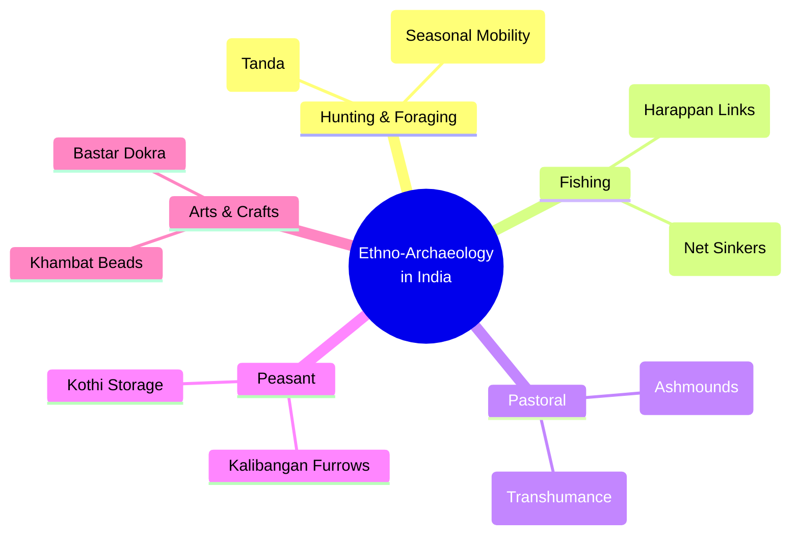

# VALUE ADD: Unit 1.3 - UNIT 1.2 & 1.3: PALAEO-ANTHROPOLOGY & ETHNO-ARCHAEOLOGY IN INDIA
**Date:** June 12, 2026 | **Target:** PAPER II — UNIT 1.2 & 1.3: PALAEO-ANTHROPOLOGY & ETHNO-ARCHAEOLOGY IN INDIA
**Syllabus Mapping:** Unit 1.3

# UPSC ANTHROPOLOGY PAPER II — UNIT 1.3
## HIGH-YIELD REVISION SHEET: ETHNO-ARCHAEOLOGY IN INDIA

---

## SECTION 1: THEORETICAL FRAMEWORK & EPISTEMOLOGY

Ethno-archaeology is not merely the collection of ethnographic parallels; it is a rigorous **epistemological tool** designed to generate and test hypotheses about past human behavior using observations from living societies.

```
                  [ SYSTEMIC CONTEXT ] (Living Society)
             Behavior, Beliefs, Technology, Social Structure
                                   │
                                   │ (Taphonomic Processes / Discard)
                                   ▼
                [ ARCHAEOLOGICAL CONTEXT ] (Static Record)
                     Artifacts, Ecofacts, Features
                                   ▲
                                   │ (Ethno-archaeological Analogy)
                                   │
         [ MIDDLE-RANGE THEORY ] (Bridges Static & Dynamic)
```

### 1. Key Methodological Concepts
* **Middle-Range Theory (Lewis Binford):** A conceptual framework that bridges the gap between the **static** archaeological record (bones, stones, potsherds) and the **dynamic** human behaviors of the past that produced them.
* **Actualistic Studies:** Direct observation of ongoing behavioral processes (e.g., butchery, tool manufacture, site abandonment) and their physical consequences in the material record.
* **Chaine Opératoire (Operational Sequence):** Reconstructing the entire life history of an artifact—from raw material extraction, production, and use, to maintenance and final discard—by studying living craftspeople.

### 2. The Two Engines of Analogy

| Feature | Survivals (Direct Historical Analogy) | Parallels (General Comparative Analogy) |
| :--- | :--- | :--- |
| **Core Principle** | **Temporal Continuity** within the same geographical region. | **Functional/Ecological Similarity** across different regions. |
| **Assumption** | The living community is a direct cultural descendant of the archaeological population. | Similar ecological pressures and technology yield similar material patterns. |
| **Method** | Tracing a continuous lineage backward in time (*Direct Historical Approach*). | Comparing unrelated groups sharing similar socio-economic levels. |
| **Indian Example** | Studying **Khambat bead makers** to interpret **Lothal** Harappan workshops. | Using **Kalahari San** camp layouts to interpret **Bhimbetka** Mesolithic sites. |

---

## SECTION 2: THE THINKERS & SCHOLARS DIRECTORY

Use these academic references to anchor your answers and secure high marks:

```
┌─────────────────────────────────────────────────────────────────────────┐
│                      PIONEERS OF INDIAN ETHNO-ARCHAEOLOGY               │
├───────────────────┬──────────────────────────┬──────────────────────────┤
│ Scholar           │ Field Area / Community   │ Key Contribution         │
├───────────────────┼──────────────────────────┼──────────────────────────┤
│ D.D. Kosambi      │ Maharashtra Deccan       │ "Living Prehistory"      │
│ V.N. Misra        │ Rajasthan (Van Vagris)   │ Mesolithic Continuity    │
│ M.L.K. Murty      │ Andhra (Chenchus/Yerukula)│ Palaeolithic Subsistence │
│ K. Paddayya       │ Hunsgi Valley (Boyas)    │ Formation Processes      │
│ Carol Kramer      │ Rajasthan (Potters)      │ Ceramic Ethnoarchaeology │
│ Massimo Vidale    │ Khambat (Bead Makers)    │ Harappan Pyrotechnology  │
└───────────────────┴──────────────────────────┴──────────────────────────┘
```

* **D.D. Kosambi (1960s):** Pioneered the view that India's rural and tribal societies preserve ancient technological and social stages. He argued that the Indian countryside is a "living museum" where different historical epochs co-exist.
* **V.N. Misra:** Conducted extensive work on the **Van Vagris** (nomadic hunters of Rajasthan) and **Bagor** (Mesolithic site), demonstrating how modern hunting-gathering strategies explain the distribution of microliths and animal bones in the archaeological record.
* **M.L.K. Murty:** Studied the **Chenchus** and **Yerukulas** of Andhra Pradesh, using their wild plant exploitation and small-game trapping strategies to reconstruct Late Pleistocene and Holocene subsistence patterns in the Eastern Ghats.
* **K. Paddayya:** Applied **Lewis Binford’s New Archaeology** paradigms to the Hunsgi Valley (Karnataka). By studying the **Boya** community, he reconstructed the settlement-subsistence systems of the Acheulian hunter-gatherers.
* **Carol Kramer:** Her seminal work *Pottery in Rajasthan* analyzed how ceramic distribution, vessel functions, and potter demographics in living villages can prevent archaeologists from misinterpreting "pottery styles" as distinct "ethnic cultures."

---

## SECTION 3: DEEP-DIVE CASE STUDIES (BY COMMUNITY TYPE)



### 1. Hunting & Foraging Communities (Palaeolithic & Mesolithic Reconstructions)

#### A. The Birhor of Jharkhand (Study by V.N. Misra & others)
* **Ethnographic Reality:** The Birhor are nomadic hunter-gatherers living in temporary circular settlements called **Tandas**. They construct conical leaf-and-branch huts called **Kumbhas**.
* **Archaeological Application:** 
  * **Site Abandonment & Taphonomy:** When a Birhor Tanda is abandoned, organic materials (leaves, wood, bark ropes) decay within months, leaving only hearth stones, stone anvils used for crushing wild nuts, and circular depressions.
  * **Analogy:** This explains why Mesolithic sites in Central India (like **Bagor** or **Bhimbetka**) show circular stone alignments but lack structural remains. It warns archaeologists that "empty" sites do not mean "unoccupied" sites.

#### B. The Chenchus of Nallamala Hills, Andhra Pradesh (Study by M.L.K. Murty)
* **Ethnographic Reality:** The Chenchus use simple iron-tipped digging sticks to extract wild tubers (*Dioscorea*) and employ specialized traps for monitor lizards, birds, and small game.
* **Archaeological Application:**
  * **Subsistence Reconstruction:** Their seasonal exploitation of forest micro-environments explains how Upper Palaeolithic and Mesolithic populations survived in the semi-arid Deccan without relying solely on large-game hunting.

---

### 2. Fishing Communities (Mesolithic & Harappan Reconstructions)

#### A. The Macchiyar and Kharwa of Coastal Gujarat
* **Ethnographic Reality:** These traditional fishing communities use terracotta net-sinkers, bone/copper gorges, and specific seasonal patterns of drying fish on raised wooden platforms.
* **Archaeological Application:**
  * **Harappan Maritime Trade:** Excavations at Harappan coastal outposts like **Padri** and **Kuntasi** yielded numerous terracotta rings and copper hooks. 
  * By studying the *Macchiyar* use of tidal currents and traditional preservation techniques (salting and sun-drying), archaeologists reconstructed how Harappans preserved and transported marine resources to inland cities like Harappa and Mohenjo-daro.

#### B. Riverine Fishers of the Ganga Basin
* **Ethnographic Reality:** Use of bamboo traps (*Bana*) and clay weights to sink nets in shallow river channels.
* **Archaeological Application:** Explains the functional utility of notched pebbles found at Mesolithic riverine sites like **Sarai Nahar Rai** and **Mahadaha** (Uttar Pradesh).

---

### 3. Pastoral Communities (Neolithic & Chalcolithic Reconstructions)

#### A. The Toda of Nilgiri Hills (Southern India)
* **Ethnographic Reality:** The Toda are a highly specialized pastoral community centered entirely around the water buffalo. They construct semi-barrel-shaped wooden huts and circular stone-walled cattle pens (*Tuel*).
* **Archaeological Application:**
  * **Neolithic Ashmounds:** Southern Indian Neolithic sites (e.g., **Utnur**, **Kupgal**, **Budihal**) feature massive mounds of vitrified ash. 
  * **Analogy:** Ethno-archaeological studies of Toda cattle pens show that dung accumulates rapidly in enclosed stone corrals. Periodically, this dung is ritually burned. This direct parallel confirms that Neolithic ashmounds were ancient cattle-penning stations where dung was systematically accumulated and burned during seasonal festivals.

#### B. The Dhangar of Maharashtra (Study by Gunther Sontheimer)
* **Ethnographic Reality:** The Dhangars are nomadic sheep pastoralists who practice seasonal transhumance, moving from the dry Deccan plateau to the wet Konkan coast post-monsoon. They enter into symbiotic relationships with settled peasants, penning their sheep in harvested fields to fertilize the soil with manure in exchange for grain.
* **Archaeological Application:**
  * **Chalcolithic Symbiosis:** Explains the co-existence of sedentary farming villages (like **Inamgaon** and **Daimabad**) and temporary pastoral encampments. It proves that the "pastoral vs. peasant" dynamic was not conflict-ridden, but rather a highly integrated economic network.

---

### 4. Peasant Communities (Neolithic, Chalcolithic & Harappan Reconstructions)

#### A. Traditional Ploughing in Haryana and Rajasthan
* **Ethnographic Reality:** Farmers in Hanumangarh (Rajasthan) still use a wooden plough (*Hal*) drawn by oxen, creating a grid pattern of intersecting furrows to sow mixed crops (mustard in one direction, chickpea in the other).
* **Archaeological Application:**
  * **The Kalibangan Furrow Field:** During excavations at the Early Harappan levels of **Kalibangan**, archaeologists discovered a preserved ploughed field with a grid of intersecting furrows.
  * **Analogy:** The modern peasant practice in the exact same region provided a **direct historical survival**, proving that 4,500 years ago, Harappan peasants used the same agricultural technology and mixed-cropping strategies to maximize yield and hedge against monsoon failure.

#### B. Traditional Grain Storage: Kothi and Bukhari
* **Ethnographic Reality:** Rural households in Indo-Gangetic plains construct large, unfired clay bins (*Kothis*) raised on legs to prevent moisture and rodent damage.
* **Archaeological Application:** Explains the circular clay patches and post-holes found in Chalcolithic houses at **Inamgaon**, allowing archaeologists to identify domestic storage areas.

---

### 5. Arts & Crafts Producing Communities (Pyrotechnology & Craft Specialization)

#### A. The Carnelian Bead Makers of Khambat, Gujarat (Study by Kenoyer, Vidale & Bhan)
* **Ethnographic Reality:** Traditional artisans in Khambat still manufacture carnelian beads using ancient techniques: solar roasting of raw stone to deepen color, indirect percussion chipping, and drilling using specialized diamond or chert drills.
* **Archaeological Application:**

```
[Raw Stone] ──> [Solar Roasting] ──> [Chipping] ──> [Drilling] ──> [Polishing]
     │                  │                 │              │               │
     ▼                  ▼                 ▼              ▼               ▼
(Harappan equivalents found at Lothal & Chanhudaro workshops via debitage analysis)
```

* By mapping the distribution of micro-debitage (tiny stone chips) in modern Khambat workshops, archaeologists could identify the exact workspaces, skill levels, and production scales of Harappan bead factories at **Lothal** and **Chanhudaro**.

#### B. Bastar Dokra Metal Casters (Lost-Wax Process / Cire Perdue)
* **Ethnographic Reality:** Tribal artisans in Bastar (Chhattisgarh) use the lost-wax technique (*cire perdue*) to cast hollow bronze figurines. They build a clay core, wrap it in wax threads, cover it with outer clay, melt the wax out, and pour molten metal in.
* **Archaeological Application:**
  * **Harappan Metallurgy:** This craft serves as a technological parallel to explain the manufacture of the famous **"Dancing Girl" of Mohenjo-daro** (2500 BCE), proving that the sophisticated metallurgical knowledge of the Bronze Age has survived continuously in tribal central India.

---

## SECTION 4: CRITICAL LIMITATIONS & EPISTEMOLOGICAL TRAPS

While ethno-archaeology is a powerful tool, it is highly vulnerable to methodological errors if applied uncritically.

```
┌─────────────────────────────────────────────────────────────────────────┐
│                    LIMITATIONS OF ETHNO-ARCHAEOLOGY                     │
├───────────────────────────┬─────────────────────────────────────────────┤
│ Epistemological Trap      │ Anthropological Reality                     │
├───────────────────────────┼─────────────────────────────────────────────┤
│ The "Frozen Time" Fallacy │ Living societies are not static fossils;    │
│                           │ they have evolved over millennia.           │
├───────────────────────────┼─────────────────────────────────────────────┤
│ The Tautology Trap        │ Using a modern analogy to prove a past      │
│                           │ behavior, then using that "proven" past     │
│                           │ to validate the modern analogy.             │
├───────────────────────────┼─────────────────────────────────────────────┤
│ The "Asymmetry of Power"  │ Modern hunter-gatherers are marginalized by │
│                           │ state laws, forestry, and global markets;   │
│                           │ prehistoric ones were dominant.             │
└───────────────────────────┴─────────────────────────────────────────────┘
```

1. **The Fallacy of "Frozen Time" (The "Peter Pan" Bias):**
   * *The Error:* Treating contemporary tribal groups (e.g., Birhors or Chenchus) as "living fossils" who have remained unchanged since the Stone Age.
   * *The Correction:* Modern tribal groups have dynamic histories, have adapted to external pressures, and are not pristine representations of the past.
2. **The Tautology (Circular Reasoning) Trap:**
   * *The Error:* An archaeologist observes a pattern in the archaeological record, finds a similar pattern in a living group, and concludes they are identical, without testing alternative hypotheses.
3. **The Encroachment of Modernity (The "Contamination" of Analogy):**
   * *The Error:* Ignoring the impact of the market economy, plastic, iron tools, and state forest laws on modern communities.
   * *Example:* Modern Chenchus use plastic bottles and iron knives. Their mobility is restricted by Tiger Reserve regulations, not just ecological seasons. Archaeologists must filter out these modern variables before drawing analogies.

---

## SECTION 5: UPSC MAIN EXAM - MODEL ANSWER BLUEPRINT

### QUESTION: "Discuss how the study of survivals and parallels among arts and crafts producing communities helps in reconstructing Harappan technology." (15 Marks, 250 Words)

#### 1. Introduction (approx. 40 words)
* **Define Ethno-archaeology:** It is the study of contemporary material culture to reconstruct past lifeways.
* **Introduce the Core Concepts:** State that **Survivals** (direct historical continuity) and **Parallels** (functional similarities) serve as the primary methodological tools to decode Harappan technology.
* **Quote:** Cite D.D. Kosambi's observation that in India, *"the past survives into the present without being completely obliterated."*

#### 2. Body Paragraph 1: Survivals in Harappan Pyrotechnology & Bead Making (approx. 80 words)
* **Case Study:** The **Khambat Carnelian Bead Makers** of Gujarat (studied by J.M. Kenoyer and Massimo Vidale).
* **Application:** The modern *chaine opératoire* (solar roasting, specialized chert drilling, and polishing) directly mirrors the archaeological debitage found at **Lothal** and **Chanhudaro**.
* **Value-Add:** This survival proves that Harappans possessed highly specialized, standardized craft workshops and long-distance raw material procurement networks.

#### 3. Body Paragraph 2: Parallels in Metal Casting & Pottery (approx. 80 words)
* **Case Study 1 (Metal):** The **Bastar Dokra (Lost-Wax)** metal casters.
  * *Application:* Explains the casting technology of the **Mohenjo-daro "Dancing Girl"**, demonstrating a continuous technological lineage of *cire perdue* casting in India.
* **Case Study 2 (Ceramics):** The **Kumbhar Potters** of Rajasthan (studied by Carol Kramer).
  * *Application:* Studying their clay-sourcing, wheel-throwing, and open-kiln firing techniques helps archaeologists estimate the labor investment, scale of production, and social organization of Harappan ceramic workshops.

```
[Bastar Dokra Casters]  ──(Parallel: Lost-Wax)──>  [Mohenjo-daro Dancing Girl]
[Khambat Bead Makers]   ──(Survival: Drilling)──>  [Chanhudaro Workshops]
```

#### 4. Critical Evaluation (approx. 30 words)
* Warn against the **"Frozen Time" fallacy**. Modern craftspeople operate within a globalized cash economy, whereas Harappan artisans worked under a state-controlled or guild-based bronze-age economy.

#### 5. Conclusion (approx. 20 words)
* Conclude that ethno-archaeology rescues Harappan artifacts from being mere museum showpieces, transforming them into active indicators of human behavior, cognitive skill, and socio-economic organization.