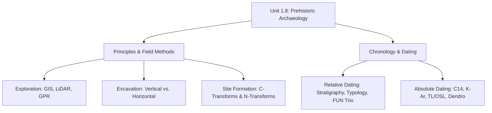
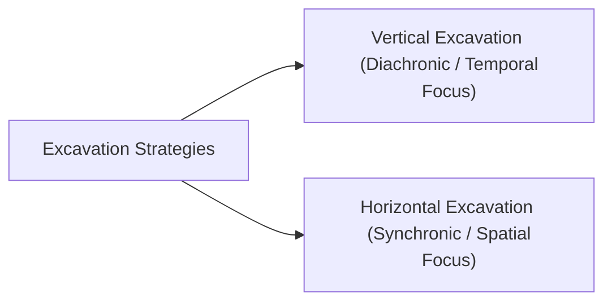
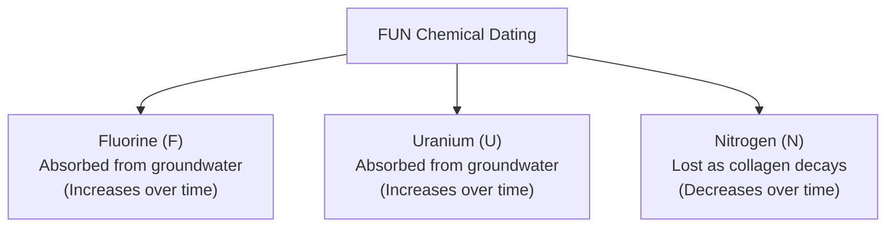

# VALUE ADD: Unit 1.8 - UNIT 1.2 & 1.3: PALAEO-ANTHROPOLOGY & ETHNO-ARCHAEOLOGY IN INDIA
**Date:** June 13, 2026 | **Target:** PAPER II — UNIT 1.2 & 1.3: PALAEO-ANTHROPOLOGY & ETHNO-ARCHAEOLOGY IN INDIA
**Syllabus Mapping:** Unit 1.8

# PAPER I — UNIT 1.8: PRINCIPLES OF PREHISTORIC ARCHAEOLOGY & CHRONOLOGY

---

## SYSTEMIC OVERVIEW OF UNIT 1.8

This unit forms the methodological backbone of archaeological anthropology. It deals with how archaeologists locate, excavate, analyze, and date the material remains of past human societies to reconstruct extinct lifeways.



---

## SECTION I: PRINCIPLES OF PREHISTORIC ARCHAEOLOGY

Prehistoric archaeology is the study of past cultures prior to the invention of writing systems. Because there are no written records, archaeologists rely entirely on **material culture** (artifacts, ecofacts, features, and structures) to reconstruct human behavior, cognitive evolution, and socio-economic systems.

### 1. Archaeological Site Formation Processes (Michael Schiffer's Framework)
An archaeological site is not a pristine, frozen snapshot of the past. It is a dynamic entity shaped by two distinct processes:

```
[Systemic Context: Living Culture] 
       │
       ▼ (Discard, Loss, Abandonment)
[Archaeological Context: Soil Matrix]
       │
       ├─► Cultural Transforms (C-Transforms): Re-excavation, looting, farming, construction
       │
       └─► Natural Transforms (N-Transforms): Bioturbation, cryoturbation, erosion, decay
```

* **Cultural Transforms (C-Transforms):** Deliberate or accidental human activities that alter or deposit material remains (e.g., tool manufacture discard, burying the dead, recycling materials, modern agricultural plowing).
* **Natural Transforms (N-Transforms):** Environmental and post-depositional processes that alter, preserve, or destroy organic and inorganic materials (e.g., soil acidity destroying bone, waterlogging preserving wood, earthworms causing **bioturbation**).

---

### 2. Field Methods: Exploration vs. Excavation

#### A. Archaeological Exploration (Non-Destructive Methods)
Before digging, archaeologists must locate and map sites. Modern exploration has shifted from simple foot surveys to high-tech, non-invasive remote sensing:
* **LiDAR (Light Detection and Ranging):** Uses laser pulses from aircraft to penetrate dense forest canopies, revealing hidden micro-topography (e.g., mapping hidden Mayan cities or early medieval settlements in India).
* **Ground Penetrating Radar (GPR):** Sends electromagnetic pulses into the soil; reflections map subsurface anomalies (walls, voids, burials) without breaking ground.
* **Geographical Information Systems (GIS):** Used for predictive modeling, analyzing site distribution patterns relative to water sources, raw materials, and topography.

#### B. Archaeological Excavation (Destructive Methods)
Excavation is inherently destructive; a site can only be excavated once. Therefore, systematic recording is critical.



| Feature | Vertical Excavation (Wheeler-Kenyon Method) | Horizontal Excavation (Grid/Area Method) |
| :--- | :--- | :--- |
| **Primary Focus** | **Temporal Sequence (Diachronic)**: Establishes the chronological depth and cultural succession of a site over time. | **Spatial Layout (Synchronic)**: Exposes a large area of a single cultural layer to understand community life, house plans, and activity areas. |
| **Methodology** | Deep, restricted trenches cutting through multiple stratigraphic layers. | Broad, shallow exposure of a single stratum, often using a grid system with baulks (dirt walls) left between squares for stratigraphic control. |
| **Pros** | Cost-effective, fast, excellent for establishing a regional chronological framework. | Excellent for reconstructing social organization, trade, craft specialization, and household activities. |
| **Cons** | Provides limited information on the spatial organization of any single period. | Extremely expensive, time-consuming, and destroys large portions of the site's stratigraphy. |
| **Indian Example** | **Nevasa** (excavated by H.D. Sankalia to establish the Stone Age sequence). | **Inamgaon** (Chalcolithic site excavated by M.K. Dhavalikar to study household archaeology) or **Lothal**. |

---

## SECTION II: CHRONOLOGY — RELATIVE DATING METHODS

Relative dating does not provide an age in calendar years. Instead, it determines whether an object or stratum is **older than, younger than, or contemporary with** another.

```
[Youngest Stratum]  ──►  Stratum A (Contains modern pottery)
                         Stratum B (Contains bronze tools)
[Oldest Stratum]    ──►  Stratum C (Contains Acheulian handaxes)
```

### 1. Stratigraphy (The Law of Superposition)
* **Principle:** Formulated by Nicolaus Steno. In an undisturbed sequence of sedimentary rocks or cultural layers, the oldest layer lies at the bottom, and successive layers above are progressively younger.
* **Anthropological Application:** Allows archaeologists to construct regional cultural sequences (e.g., Palaeolithic $\rightarrow$ Mesolithic $\rightarrow$ Neolithic).
* **Limitations:** **Reverse stratigraphy** can occur due to tectonic activity, animal burrowing (bioturbation), or human pit-digging, which pushes older artifacts to the surface.

### 2. Typology and Seriation
* **Principle:** Artifacts of a given time and place have a recognizable style or morphology. Changes in style are gradual and evolutionary.
* **Seriation (Sequence Dating):** Developed by **Sir Flinders Petrie**. It arranges assemblages of artifacts in a chronological order based on the popularity of specific styles over time (producing classic "battleship curves" of style rise and fall).
* **Application:** Dating graves in a cemetery based on the changing styles of pottery found within them.

### 3. Chemical Dating of Bone: The FUN Trio
When bones are buried, they exchange chemical elements with the surrounding groundwater. This allows for relative dating of bones found within the same micro-environment.



* **The Piltdown Man Hoax (1953):** **Kenneth Oakley** used Fluorine dating to prove that the "Piltdown Man" skull (claimed to be the "missing link" between ape and human) was a fraud. The human cranium and orangutan jaw had completely different fluorine levels, proving they were of different ages and artificially planted.
* **Limitation:** Cannot be used to compare bones from different geographical regions, as groundwater chemical concentrations vary widely.

### 4. Palynology (Pollen Analysis)
* **Principle:** Developed by Lennart von Post. Pollen grains have highly resistant outer shells (exines) with species-specific morphology.
* **Application:** By extracting pollen sequences from soil cores (especially in bogs or lake beds), archaeologists can reconstruct past climate fluctuations and vegetation shifts. Sites can then be dated relatively by matching their pollen profiles to established regional climate phases.

---

## SECTION III: CHRONOLOGY — ABSOLUTE (CHRONOMETRIC) DATING METHODS

Absolute dating provides an estimate of age in actual calendar years (e.g., $3500 \pm 50$ years BP - Before Present, where "Present" is standardized to AD 1950).

```mermaid
classDef absolute fill:#e1f5fe,stroke:#01579b,stroke-width:2px;
classDef relative fill:#efebe9,stroke:#4e342e,stroke-width:2px;

subgraph Absolute_Methods [Absolute Dating]
    C14[Radiocarbon: Organic, <50k yr]:::absolute
    KAr[Potassium-Argon: Volcanic, >100k yr]:::absolute
    TL[Thermoluminescence: Pottery/Burnt Clay]:::absolute
    OSL[Optically Stimulated Luminescence: Sediments]:::absolute
    Dendro[Dendrochronology: Tree Rings, Annual Precision]:::absolute
end
```

---

### 1. Radiocarbon ($C^{14}$) Dating
* **Discoverer:** Willard Libby (1949 - Nobel Prize).
* **Physics/Principle:** 
  * Cosmic rays enter the atmosphere, creating neutrons that collide with Nitrogen ($N^{14}$) to produce radioactive Carbon ($C^{14}$).
  * Living organisms absorb $C^{12}$ (stable) and $C^{14}$ (unstable) in a constant ratio through photosynthesis and respiration.
  * Upon death, intake stops. $C^{14}$ begins to decay back into $N^{14}$ via beta decay at a known, constant rate.
  * **Half-life ($t_{1/2}$):** $5730 \pm 40$ years (Cambridge half-life; Libby's original estimate was 5568 years).

$$\text{Decay Equation: } N_t = N_0 \cdot e^{-\lambda t}$$

* **Effective Range:** ~300 years to ~50,000 years BP.
* **Target Materials:** Charcoal, wood, bone collagen, shell, leather.
* **Calibration (The Suess & DeVries Effects):** Atmospheric $C^{14}$ levels have fluctuated over time due to changes in Earth's magnetic field and fossil fuel combustion. Raw radiocarbon ages must be calibrated against tree-ring curves to yield calendar dates (expressed as **cal BC/AD**).
* **AMS (Accelerator Mass Spectrometry):** A modern refinement that directly counts $C^{14}$ atoms relative to $C^{12}$ using a particle accelerator. 
  * *Advantage:* Requires tiny sample sizes (milligrams instead of grams) and extends the dating range up to ~60,000 years with higher precision.

---

### 2. Potassium-Argon ($K-Ar$) and Argon-Argon ($Ar-Ar$) Dating
* **Physics/Principle:** 
  * Radioactive Potassium ($K^{40}$) decays into the inert gas Argon ($Ar^{40}$).
  * **Half-life:** 1.3 billion years.
  * During volcanic eruptions, extreme heat drives out all pre-existing Argon gas, resetting the "atomic clock" to zero.
  * As volcanic rock (lava/ash) cools and solidifies, newly produced $Ar^{40}$ is trapped inside the crystal lattices of minerals (like feldspar and biotite).
* **Effective Range:** 100,000 years to 4.5 billion years (ideal for dating early hominid fossils in East Africa).
* **Target Materials:** Volcanic ash layers (tuffs), basalt, mica.
* **Application in Palaeoanthropology:** Fossils themselves are not dated; instead, the volcanic ash layers *above* and *below* the fossil-bearing stratum are dated (providing *terminus ante quem* and *terminus post quem* dates).

---

### 3. Thermoluminescence (TL) and Optically Stimulated Luminescence (OSL)

These methods are based on the accumulation of trapped electrons in mineral crystal lattices due to ambient background radiation.

```
[Mineral Crystal Lattice] ──► Exposed to Background Radiation ──► Electrons trapped in defects
                                                                        │
   ┌────────────────────────────────────────────────────────────────────┘
   ▼
[Clock Resetting Event]
   ├─► Heat (TL): Firing of pottery/burnt flint (Releases electrons as light)
   └─► Sunlight (OSL): Exposure of sand during wind/water transport (Releases electrons)
```

#### A. Thermoluminescence (TL)
* **Principle:** Clay contains crystalline minerals (quartz, feldspar). When fired in a kiln, all previously trapped electrons are released, resetting the clock to zero. Over time, buried pottery absorbs ionizing radiation from the surrounding soil, trapping new electrons. When heated to $>500^\circ\text{C}$ in a lab, these electrons escape, emitting light (thermoluminescence). The intensity of the light is proportional to the time elapsed since firing.
* **Target Materials:** Pottery, burnt clay, burnt flint tools.
* **Range:** Up to 500,000 years.

#### B. Optically Stimulated Luminescence (OSL)
* **Principle:** Similar to TL, but the resetting event is **sunlight** rather than heat. When quartz or feldspar grains are transported by wind or water, exposure to daylight empties the electron traps. Once buried under sediment, the clock restarts. In the lab, stimulation is achieved using blue or green light.
* **Target Materials:** Windblown sand (aeolian dunes), river sediments (alluvium).
* **Range:** Up to 300,000 years. Highly useful for dating Palaeolithic stone tools found in sandy, non-volcanic contexts (e.g., Thar Desert, Narmada Valley).

---

### 4. Dendrochronology (Tree-Ring Dating)
* **Discoverer:** A.E. Douglass.
* **Principle:** Many tree species produce a distinct, visible growth ring every year. The thickness of these rings varies depending on annual rainfall and climate. By matching overlapping ring patterns from living trees, historic wooden structures, and archaeological timber, scientists have built continuous master chronologies.
* **Range:** Up to ~10,000 years BP (highly regional).
* **Precision:** **Absolute annual precision** (can pinpoint the exact year a tree was felled).
* **Limitations:** Requires wood species with sensitive, climate-responsive rings (e.g., oak, pine); restricted to temperate regions with distinct seasonal changes.

---

### 5. Fission Track Dating
* **Principle:** Uranium-238 ($U^{238}$) undergoes spontaneous fission, splitting into heavy charged particles that repel each other, leaving microscopic damage tracks in volcanic glass and minerals. The density of these tracks increases over time. Heating (like volcanic eruption or glass manufacturing) heals the tracks, resetting the clock.
* **Target Materials:** Obsidian, volcanic glass, zircon crystals.
* **Range:** 100,000 to millions of years.

---

## SECTION IV: HIGH-YIELD VALUE-ADDITION & INDIAN CASE STUDIES

To score high marks in UPSC Mains, candidates must link the theoretical dating methods of Paper I, Unit 1.8 with actual archaeological discoveries in India (Paper II, Unit 1.1 & 1.2).

```mermaid
gantt
    title Chronological Milestones of Indian Prehistory (Dated Sites)
    dateFormat  YYYY
    axisFormat %Y
    
    section Lower Palaeolithic
    Attirampakkam (CRE Dating : 1.5 Million BP) : active, 1500, 1501
    
    section Middle Palaeolithic
    Attirampakkam (OSL Dating : 385,000 BP) : active, 1385, 1386
    
    section Upper Palaeolithic
    Jwalapuram (Tephrochronology/OSL : 74,000 BP) : active, 1074, 1075
    
    section Iron Age / Sangam
    Keezhadi (AMS Radiocarbon : 580 BCE) : active, 580, 581
```

### 1. Attirampakkam (Tamil Nadu) — Redefining the Indian Acheulian
* **The Site:** Excavated by Shanti Pappu (Sharma Centre for Heritage Education).
* **Dating Method Used:** **Cosmic Ray Exposure (CRE) Dating** (measuring the accumulation of cosmogenic nuclides $^{26}\text{Al}$ and $^{10}\text{Be}$ in quartz tools).
* **The Breakthrough:** Dated the Acheulian (Lower Palaeolithic) handaxes to **1.5 million years ago (mya)**. This shattered the older view that the Acheulian culture arrived late in India, proving that hominins with advanced cognitive abilities were present in South Asia contemporary with their counterparts in Africa and Europe.
* **Middle Palaeolithic Transition:** Subsequent **OSL dating** of the upper layers at Attirampakkam showed a transition to Middle Palaeolithic Levallois technology at **385,000 years ago**, far earlier than the traditional "Out of Africa" dispersal timeline (~120,000 years ago) suggested.

### 2. Jwalapuram (Andhra Pradesh) — The Toba Super-Eruption Debate
* **The Site:** Located in the Jurreru River Valley, excavated by Michael Petraglia and Ravi Korisettar.
* **Dating Method Used:** **Tephrochronology** (dating volcanic ash layers) combined with **OSL**.
* **The Breakthrough:** The site contains a thick layer of Youngest Toba Tuff (YTT) ash from the catastrophic Toba super-eruption in Sumatra (~74,000 years ago). Stone tools were found directly below and above this ash layer.
* **Significance:** OSL and stratigraphic dating proved that human populations survived the volcanic winter of the Toba eruption in India, demonstrating remarkable cognitive resilience and continuous habitation.

### 3. Keezhadi (Tamil Nadu) — Pushing Back the Sangam Era
* **The Site:** Located near Madurai, excavated by the Tamil Nadu State Department of Archaeology (TNSDA).
* **Dating Method Used:** **AMS Radiocarbon ($C^{14}$) Dating** of charcoal samples.
* **The Breakthrough:** The samples yielded a date of **580 BCE** (6th century BCE).
* **Significance:** This pushed the origin of the Sangam Era and Tamil-Brahmi script back by three centuries (previously dated to 300 BCE), establishing a "Second Urbanization" in South India contemporary with the Gangetic Valley urbanization.

### 4. Sanauli (Uttar Pradesh) — Late Harappan Chariots
* **The Site:** A burial site excavated by the Archaeological Survey of India (ASI).
* **Dating Method Used:** **AMS Radiocarbon Dating** of organic remains from the wooden coffins and copper-clad chariots.
* **The Breakthrough:** Dated to approximately **1900–1800 BCE** (Late Harappan/Ochre Coloured Pottery - OCP horizon).
* **Significance:** Proved the existence of a highly sophisticated warrior class using wheeled chariots in the Ganga-Yamuna Doab during the transition from the Bronze Age to the Iron Age.

---

## SECTION V: KEY THINKERS & METHODOLOGICAL CONTRIBUTIONS

| Thinker | Key Methodological Contribution | Relevance to Indian Archaeology |
| :--- | :--- | :--- |
| **Sir Mortimer Wheeler** | Introduced the **Wheeler-Kenyon grid-square method** of excavation, emphasizing strict stratigraphic control. | As Director-General of ASI (1944–48), he trained the first generation of modern Indian archaeologists and systematically excavated Harappa, Arikamedu, and Brahmagiri. |
| **H.D. Sankalia** | Known as the "Father of Modern Indian Prehistory." Pioneered multi-disciplinary excavations incorporating geology, palaeontology, and environmental reconstruction. | Excavated key sites like **Nevasa** (Maharashtra) and **Langhnaj** (Gujarat), establishing the first comprehensive cultural-stratigraphic sequence of prehistoric India. |
| **Lewis Binford** | Founded **Processual Archaeology ("New Archaeology")** in the 1960s. Argued that archaeology must be a science, using deductive reasoning, statistics, and middle-range theory. | Shifted Indian archaeology from mere culture-historical classification (cataloging pots and stones) to processual questions of adaptation, ecology, and settlement patterns. |
| **Michael Schiffer** | Developed **Behavioral Archaeology** and formalized the study of **Site Formation Processes** (C-transforms and N-transforms). | Crucial for Indian prehistoric sites in river valleys (like Narmada or Belan), helping archaeologists distinguish between primary habitation sites and secondary redeposited tool assemblages. |
| **Shanti Pappu** | Pioneered the application of advanced chronometric dating techniques (CRE dating, OSL) and site-formation studies in India. | Redefined the antiquity of the Indian Stone Age at Attirampakkam, placing India on the global map of early human evolution. |

---

## SECTION VI: UPSC CSE MAINS MODEL QUESTIONS & ANSWER BLUEPRINTS

### Question 1: Discuss the principles and applications of Radiocarbon dating. What are its major limitations? [15 Marks, 250 Words]

#### Answer Blueprint:
* **Introduction:** Define Radiocarbon ($C^{14}$) dating as an absolute chronometric dating method developed by Willard Libby in 1949. State its core utility: dating organic remains from the last 50,000 years.
* **Scientific Principle:**
  * Explain the production of $C^{14}$ in the atmosphere, its absorption by living organisms alongside stable $C^{12}$ in a constant ratio, and the cessation of intake at death.
  * State the decay process ($C^{14} \rightarrow N^{14} + \beta^-$) and the **half-life** ($5730 \pm 40$ years).
  * Mention **AMS (Accelerator Mass Spectrometry)** as a modern refinement that directly counts atoms, requiring smaller samples.
* **Applications:**
  * Dating organic materials: charcoal, wood, bone collagen, shell, leather.
  * Crucial for dating Neolithic, Chalcolithic, and Harappan sites in India (e.g., dating of Keezhadi to 580 BCE).
* **Limitations:**
  * **Age Limit:** Ineffective beyond ~50,000–60,000 years due to negligible remaining $C^{14}$.
  * **Fluctuations in Atmospheric Carbon:** Requires calibration due to historical variations in $C^{14}$ levels (Suess and DeVries effects).
  * **Contamination:** Modern rootlets, groundwater carbonates, or handling can introduce younger carbon, skewing results.
  * **Inorganic Materials:** Cannot date stone tools or pottery directly (unless organic temper is present).
* **Conclusion:** Despite limitations, $C^{14}$ remains the most widely used absolute dating method, bridging the gap between prehistoric archaeology and historical records.

---

### Question 2: Differentiate between Vertical and Horizontal excavation methods. Under what circumstances is each preferred? Cite Indian examples. [15 Marks, 250 Words]

#### Answer Blueprint:
* **Introduction:** Define excavation as the systematic, controlled recovery of subsurface material culture. State that the choice of excavation strategy depends on the research questions being asked.
* **Core Differences (Use a structured table):**
  * Compare **Vertical (Wheeler-Kenyon)** and **Horizontal (Grid/Area)** methods based on: Focus (Diachronic vs. Synchronic), Spatial extent, Cost/Time, and Destructiveness.
* **Circumstances of Preference & Indian Examples:**
  * **Vertical Excavation:**
    * *Preferred when:* The site's chronological sequence is unknown; budget and time are limited; the primary goal is to establish a regional cultural timeline.
    * *Indian Example:* **Nevasa** (excavated by H.D. Sankalia to establish the Palaeolithic-to-Chalcolithic sequence) or **Brahmagiri** (Wheeler's excavation to link South Indian Megalithic culture with historical periods).
  * **Horizontal Excavation:**
    * *Preferred when:* The chronology is already established; the goal is to understand socio-economic organization, trade, house plans, and spatial behavior within a single period.
    * *Indian Example:* **Inamgaon** (Maharashtra), where horizontal exposure revealed the social stratification and settlement layout of a Chalcolithic village; or **Lothal** (Gujarat) to expose the Harappan dockyard and town planning.
* **Conclusion:** Modern archaeological practice often combines both strategies, starting with vertical test pits to establish stratigraphy, followed by targeted horizontal exposure of key living surfaces.