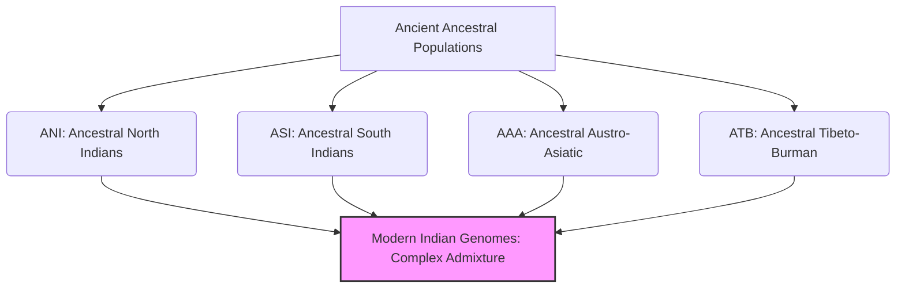

# VALUE ADD: Unit 2 - Demographic Profile of India
**Date:** June 13, 2026 | **Target:** Demographic Profile of India
**Syllabus Mapping:** Unit 2

# UPSC Anthropology Paper II — Unit 2: High-Yield Revision & Value-Addition Sheet

---

## 1. Master Thinker & Scholar Matrix (Unit 2)

Use this matrix to anchor your arguments in Paper II. Citing these scholars transforms generic demographic answers into high-scoring anthropological arguments.

| Scholar | Key Work / Concept | Core Thesis / Contribution to Unit 2 | How to Use in Answers |
| :--- | :--- | :--- | :--- |
| **Sir Herbert Hope Risley** | *The People of India* (1915) | First systematic racial classification of India using anthropometry (Nasal & Cephalic indices). Proposed 7 racial types. Conflated race with caste/language. | Use to critique colonial, pseudo-scientific racial classifications and show how biological traits were weaponized to justify caste hierarchies. |
| **B.S. Guha** | *The Racial Affinities of the Peoples of India* (1935) | Proposed 6 main racial groups with 9 subtypes. Identified the **Negrito** as the earliest autochthones. Used rigorous morphological and metric data. | Use as the standard, most accepted classical classification of ethnic elements in India. |
| **S.S. Sarkar** | *A Physical Survey of the Peoples of India* (1961) | Rejected Risley's linguistic-racial conflation. Proposed 6 morphological groups. Identified **Australoids** (not Dravidians) as the base population of India. | Use to contrast with Risley and Guha, highlighting the shift toward purely morphological and genetic-adjacent classifications. |
| **Sir George Grierson** | *Linguistic Survey of India* (1903–1928) | Identified 179 languages and 544 dialects, classifying them into 4 major language families. | The foundational authority for any question on the linguistic elements of the Indian population. |
| **Dr. G.N. Devy** | *People's Linguistic Survey of India* (PLSI, 2013) | Documented 780 living languages in India. Highlighted that India has lost nearly 250 languages in the last 50 years. | Use to provide contemporary data on linguistic diversity, language death, and tribal language endangerment. |
| **David Reich et al.** | *Reich Lab Genomic Studies* (2009, 2013) | Proved that modern Indians are a genetic admixture of two ancient populations: **Ancestral North Indians (ANI)** and **Ancestral South Indians (ASI)**. | **Crucial Modern Value-Add:** Use to update classical racial theories (Guha/Risley) with contemporary molecular anthropology. |
| **Ashish Bose** | *Demographic Transition in India* | Coined the term **BIMARU** states to highlight regional imbalances in demographic transition and fertility rates. | Use in questions regarding factors influencing population growth and regional demographic imbalances. |
| **Mahmood Mamdani** | *The Myth of Population Control* (1972) | Argued that high fertility in agrarian societies is a rational economic choice (children as economic assets/labor). | Use to provide an anthropological critique of top-down, purely clinical population control policies. |

---

## 2. Genetic Anthropology vs. Classical Racial Classifications

Modern molecular anthropology has rendered the term "race" obsolete, replacing it with **genetic lineages and admixtures**. To score maximum marks, contrast classical classifications with modern genomic data.



### The Genomic Paradigm Shift (Reich et al., 2009 / CCMB Hyderabad)
* **Ancestral North Indians (ANI):** Genetically related to West Eurasians, Central Asians, and Middle Easterners. Predominant in northern India and among upper-caste groups.
* **Ancestral South Indians (ASI):** Genetically distinct from West Eurasians. Predominant in southern India and among tribal populations (especially Dravidian-speaking groups).
* **Ancestral Austro-Asiatic (AAA) & Ancestral Tibeto-Burman (ATB):** Later genomic studies identified these distinct genetic signatures among the Munda-speaking tribes of Central India and the Mongoloid groups of the Northeast, respectively.
* **The Admixture Event:** Genomic data shows that between **4,200 to 1,900 years ago**, intense demographic mixing occurred across India, transcending linguistic and geographic barriers. Post-1,900 years BP, the transition to strict endogamy (emergence of the caste system) frozen these genetic profiles into distinct endogamous pools.

> [!NOTE]
> **Anthropological Takeaway:** Modern genetics proves that there is no "pure" race in India. The Indian population is a highly complex genetic cline (admixture gradient) rather than a collection of distinct, water-tight racial compartments as proposed by colonial administrators like Risley.

---

## 3. Linguistic Elements & Tribal Dialect Dynamics

While Grierson's classification remains the structural baseline, contemporary anthropology focuses on **linguistic shifts, endangerment, and identity politics**.

```
                       INDIAN LINGUISTIC TREE
                                 │
         ┌───────────────────────┼───────────────────────┬──────────────────────┐
         ▼                       ▼                       ▼                      ▼
   Indo-European             Dravidian             Austro-Asiatic          Sino-Tibetan
  (Indo-Aryan)            (South/Central)             (Munda)            (Tibeto-Burman)
   [~78% Pop]               [~20% Pop]               [~1.2% Pop]           [~0.6% Pop]
  e.g., Sanskrit,          e.g., Tamil,             e.g., Santhali,        e.g., Bodo,
  Hindi, Bengali           Telugu, Gondi            Mundari, Ho            Mizo, Meitei
```

### Key Linguistic Vulnerabilities & Case Studies
1. **Linguistic Shift (Assimilation):** 
   * Many tribal groups are abandoning their mother tongues in favor of regional dominant languages (e.g., Kurukh speakers shifting to Sadri/Hindi in Jharkhand) due to economic marginalization and educational policies.
   * *Anthropological Concept:* **Linguistic Imperialism** and **Deculturation**.
2. **Linguistic Survival & Revivalism:**
   * The **Ol Chiki script** (created by Raghunath Murmu for Santhali) has become a powerful symbol of tribal identity, leading to the inclusion of Santhali in the 8th Schedule of the Constitution (92nd Amendment Act, 2003).
3. **Endangered Languages of Small Populations:**
   * The Great Andamanese languages (e.g., Jeru, Bo) are virtually extinct. The death of Boa Sr in 2010 marked the extinction of the **Bo language**, erasing thousands of years of oral ecological knowledge.

---

## 4. Contemporary Demographic Challenges: Case Studies & Data

Integrate these real-world case studies and NFHS-5 (National Family Health Survey-5) data points to ground your theoretical arguments in current realities.

### Case Study 1: The "Marriage Squeeze" in Haryana
* **Context:** Decades of skewed Child Sex Ratio (CSR) due to son preference and technology-aided female foeticide.
* **Socio-Demographic Impact:** A severe deficit of marriageable women in Haryana and Punjab has led to the phenomenon of **"Paro"** or **"Bahu-Beti"**—cross-regional bride trafficking. 
* **Anthropological Analysis:** Women from economically distressed regions (e.g., West Bengal, Assam, Kerala) are bought/married into Haryanvi households. These women face extreme cultural alienation, lack of kinship support networks, and low social status, disrupting traditional rules of regional exogamy and caste endogamy.

### Case Study 2: Demographic Divergence & Federal Friction
* **The Data (NFHS-5):**
  * **Southern States:** Kerala (TFR 1.8), Tamil Nadu (TFR 1.8) are well below the replacement level of fertility (2.1).
  * **Northern States:** Bihar (TFR 2.98), Uttar Pradesh (TFR 2.35) continue to have high fertility rates.
* **The Challenge:** This divergence creates a **"Demographic Divergence"**. Southern states have successfully implemented family planning but now face a rapidly aging population and labor shortages. Northern states have a youth bulge but suffer from low human capital development.
* **Federal Tension:** This asymmetry complicates the delimitation of parliamentary seats (which could politically penalize southern states for successful population control) and the allocation of financial resources by the Finance Commission.

```
DEMOGRAPHIC DIVERGENCE PROFILE
┌──────────────────────────────────────┐     ┌──────────────────────────────────────┐
│            SOUTHERN ZONE             │     │            NORTHERN ZONE             │
├──────────────────────────────────────┤     ├──────────────────────────────────────┤
│ • Low TFR (<1.8)                     │     │ • High TFR (>2.4)                    │
│ • Rapidly Aging Population           │     │ • Youth Bulge / High Dependency      │
│ • Labor Deficit (In-migration)       │     │ • Labor Surplus (Out-migration)      │
│ • High Human Development Index       │     │ • Low Human Development Index        │
└──────────────────────────────────────┘     └──────────────────────────────────────┘
```

### Case Study 3: The "Indigenous Paradox" in Tribal Health
* **Context:** Despite living in resource-rich ecological niches with deep traditional medicine systems, Central Indian tribes (e.g., Sahariyas, Gonds) exhibit some of the highest infant mortality rates (IMR) and maternal mortality rates (MMR) in India.
* **Anthropological Explanation:** This is not merely a medical failure but a cultural mismatch. Government healthcare delivery systems often ignore tribal perceptions of health, disease, and childbirth (e.g., preference for home deliveries conducted by traditional birth attendants or *Dais*). 
* **Solution:** Culturally sensitive interventions, such as training tribal *Dais* under the National Health Mission, bridge the gap between traditional ethnomedicine and modern biomedicine.

---

## 5. Quick-Reference Revision Maps

### Ethnic Elements (Guha's Classification)
* **Negrito:** Kadars, Irulas, Paniyans (South India); Great Andamanese, Onge, Jarawa (Andaman Islands). *Traits: Woolly hair, bulbous forehead.*
* **Proto-Australoid:** Santhals, Bhils, Gonds, Chenchus. *Traits: Platyrrhine (broad) nose, wavy hair, dark skin.*
* **Mongoloid:** 
  * *Palaeo-Mongoloid:* Bodo, Garo, Khasi (Northeast India).
  * *Tibeto-Mongoloid:* Bhutias, Lepchas (Sikkim, Ladakh).
* **Mediterranean:** Dravidian-speaking populations of South India; also present in North India. *Traits: Medium stature, long head (dolichocephalic).*
* **Western Brachycephals:** Coorgis, Nagar Brahmins of Gujarat, Kayasthas of Bengal. *Traits: Broad head (brachycephalic).*
* **Nordic:** Predominant in Punjab, Haryana, Rajasthan (upper castes). *Traits: Tall, fair skin, leptorrhine (narrow) nose.*

### Factors Influencing Population Growth (Anthropological Lens)

```
                       POPULATION GROWTH FACTORS
                                  │
         ┌────────────────────────┼────────────────────────┐
         ▼                        ▼                        ▼
     Fertility                Mortality                Migration
  (Socio-Cultural)          (Eco-Health)          (Push-Pull Dynamics)
  • Son Meta-Preference     • Tribal Health Gap   • Distress Migration
  • Universality of         • Nutritional         • Displacement due to
    Marriage                  Deficiencies          Development Projects
  • Kinship & Lineage       • Access to Primary   • Seasonal Agrarian
    Continuity                Healthcare            Circulation
```

* **Fertility:** Deeply tied to the **Patrilineal Kinship System**. The absolute necessity of a male heir for performing ancestral mortuary rites (e.g., *Shraddha*) drives the "son meta-preference" (families continuing to have children until a son is born), keeping fertility rates high despite family planning programs.
* **Mortality:** Influenced by **Nutritional Anthropology**. Tribal populations suffer from chronic energy deficiency (CED) and genetic vulnerabilities like Sickle Cell Anemia and G6PD deficiency, which elevate mortality rates in malaria-endemic zones.
* **Migration:** Driven by **Development-Induced Displacement**. Anthropologist Walter Fernandes notes that millions of tribals have been displaced by dams, mines, and wildlife sanctuaries since independence, forcing them into precarious, informal urban labor migration streams (e.g., the "Gond/Santhal migration corridor" to brick kilns and construction sites).