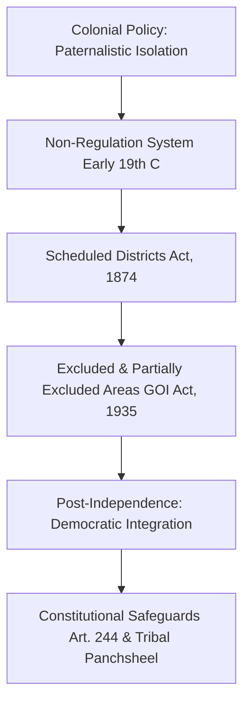
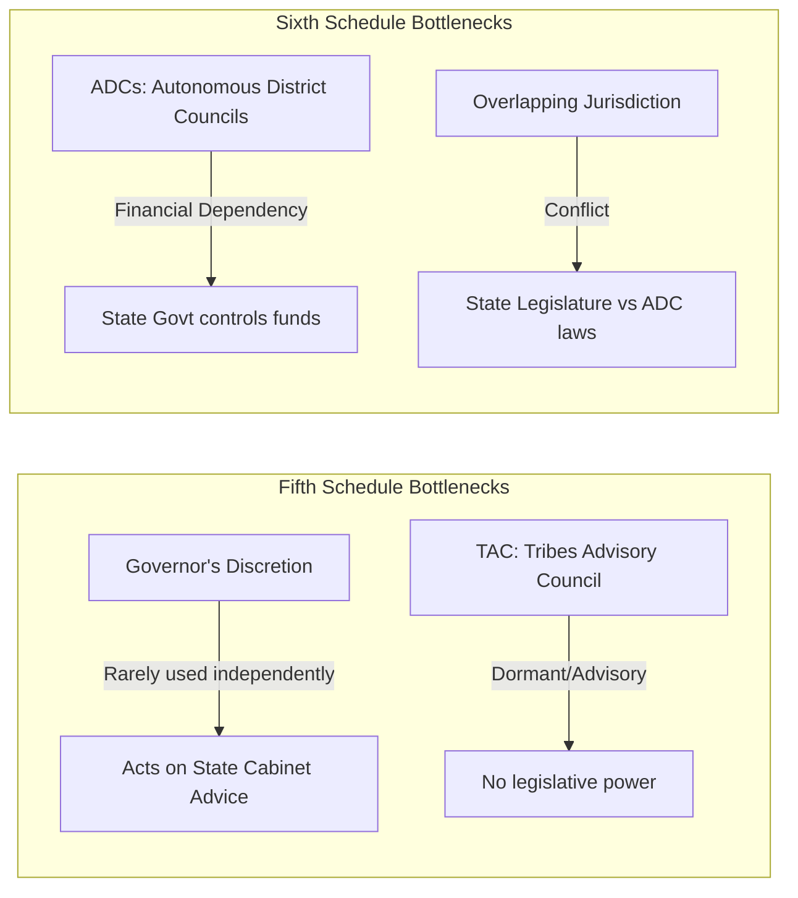
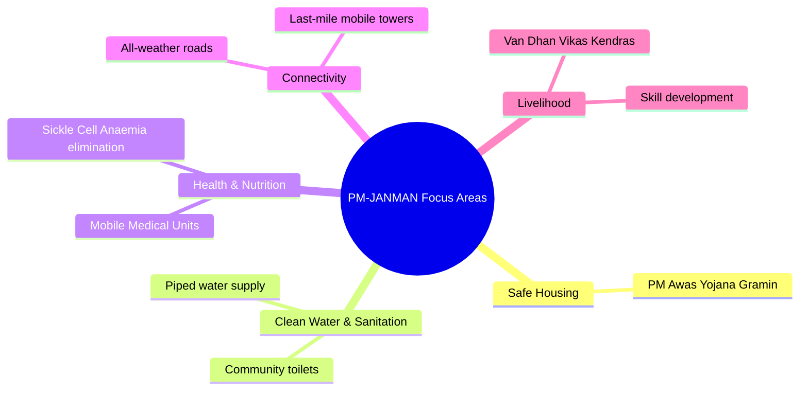

# VALUE ADD: Unit 7.2 - UNITS 7.2, 8.1 & 9: TRIBAL POLICY, MOVEMENTS & INTEGRATION
**Date:** May 31, 2026 | **Target:** PAPER II — UNITS 7.2, 8.1 & 9: TRIBAL POLICY, MOVEMENTS & INTEGRATION
**Syllabus Mapping:** Unit 7.2

# HIGH-YIELD REVISION SHEET: UNIT 7.2
**Syllabus Focus:** History of administration of tribal areas; tribal policies, plans, programmes of development and their implementation; Constitutional safeguards for Scheduled Tribes — Fifth and Sixth Schedules; PESA Act, 1996; Forest Policies and Forest Rights Act (FRA), 2006.

---

## SECTION 1: HISTORICAL EVOLUTION OF TRIBAL ADMINISTRATION

The administration of tribal areas in India transitioned from colonial paternalistic isolation to post-independence democratic integration.



### 1. Colonial Phase: Isolation and Pacification
* **Non-Regulation System:** Introduced after early tribal uprisings (e.g., Paharia rebellion, Wilkinson’s Rule in Kolhan). It exempted tribal tracts from general civil and criminal laws, placing administration directly under a civil commissioner.
* **Scheduled Districts Act, 1874:** Legally defined tribal tracts for the first time as "Scheduled Districts," keeping them outside the jurisdiction of standard courts and legislatures.
* **Government of India Act, 1935:** Classified tribal areas into:
  * **Excluded Areas:** Administered solely by the Governor at his discretion (became the basis for the **Sixth Schedule**).
  * **Partially Excluded Areas:** Administered by the provincial ministry but subject to the Governor's veto power (became the basis for the **Fifth Schedule**).

### 2. Post-Independence Debate: Three Ideological Paradigms

```
+---------------------------------------------------------------------------------+
|                               THE TRIAD DEBATE                                  |
+-----------------------------------+---------------------------------------------+
| 1. ISOLATIONIST (National Park)   | Verrier Elwin (Early phase)                 |
|                                   | - Protect tribes from corrupting plainsmen. |
+-----------------------------------+---------------------------------------------+
| 2. ASSIMILATIONIST (Integration)  | G.S. Ghurye                                 |
|                                   | - Treat tribes as "Backward Hindus".        |
+-----------------------------------+---------------------------------------------+
| 3. INTEGRATIONIST (Middle Path)   | Jawaharlal Nehru & Verrier Elwin (Later)    |
|                                   | - Tribal Panchsheel (1958).                 |
+-----------------------------------+---------------------------------------------+
```

#### The Tribal Panchsheel (1958) — *The Golden Rules of Administration*
1. People should develop along the lines of their **own genius**; avoid imposing anything on them.
2. **Tribal rights in land and forests** should be respected.
3. Train and build up a **team of their own people** to do the work of administration and development.
4. Do not over-administer these areas or **overwhelm them with a multiplicity of schemes**.
5. Judge results not by statistics or the amount of money spent, but by the **quality of human character** that is evolved.

---

## SECTION 2: CONSTITUTIONAL SAFEGUARDS & INSTITUTIONAL MECHANISMS

### 1. Critical Evaluation of the Fifth & Sixth Schedules

While designed as instruments of self-determination, both schedules face structural bottlenecks.



#### The Fifth Schedule: Structural Lacunae
* **The "Constitutional Postman" Syndrome:** Under Paragraph 3 of the Fifth Schedule, the Governor must submit annual reports to the President. The **Virginius Xaxa Committee (2014)** noted that these reports are often delayed, bureaucratic, and prepared by state departments without critical independent evaluation.
* **Dormant Tribes Advisory Councils (TAC):** Designed as a powerful advisory body, the TAC meets infrequently. Because it lacks legislative power, it functions as a rubber stamp for state cabinet decisions.

#### The Sixth Schedule: Autonomy vs. State Conflict
* **Financial Dependency:** Autonomous District Councils (ADCs) lack independent financial resources and rely heavily on discretionary grants from state governments, which limits their functional autonomy.
* **Conflict of Laws (Article 244A):** In case of conflict between an ADC law and a State Legislative Assembly law, the state law prevails (specifically in Meghalaya), which dilutes the "state-within-a-state" concept.

---

## SECTION 3: PESA ACT, 1996 & FRA, 2006 (IMPLEMENTATION REALITIES)

These two acts shifted the paradigm of tribal administration from **paternalistic protection** to **rights-based empowerment**.

```
                           RIGHTS-BASED EMPOWERMENT
                                      │
             ┌────────────────────────┴────────────────────────┐
             ▼                                                 ▼
       PESA ACT, 1996                                    FRA, 2006
  (Political Self-Rule)                             (Economic & Forest Rights)
             │                                                 │
  • Gram Sabha as Sovereign                         • Individual Forest Rights (IFR)
  • Control over Minor Minerals                     • Community Forest Rights (CFR)
  • Control over Minor Forest Produce               • Habitat Rights for PVTGs
```

### 1. PESA Act, 1996: The "Gram Sabha" Sovereignty
* **Context:** Recommended by the **Dileep Singh Bhuria Committee (1995)** to prevent the alienation of tribal communities by extending Panchayati Raj to Fifth Schedule areas.
* **The Core Philosophy:** It recognizes the Gram Sabha as the primary custodian of traditional customs, resources, and dispute resolution, reversing the colonial top-down administrative model.

#### Implementation Gaps (The Xaxa Committee Insights)
1. **Absence of State Rules:** Several states (e.g., Jharkhand) failed to frame PESA rules for decades after the Act was passed, leaving its provisions legally unenforceable.
2. **Definition of "Minor Minerals":** State governments bypass the mandatory consultation clause for mining leases by reclassifying major minerals or acquiring land through state industrial development corporations (e.g., IDCO in Odisha).

### 2. Forest Rights Act (FRA), 2006: Correcting "Historical Injustice"
* **Individual Forest Rights (IFR):** Grants land titles up to 4 hectares to families cultivating forest land prior to December 13, 2005.
* **Community Forest Rights (CFR):** Empowers the Gram Sabha to protect, regenerate, and manage community forest resources (CFR) and collect Minor Forest Produce (MFP).

---

## SECTION 4: HIGH-YIELD CASE STUDIES FOR EXAM VALUE-ADDITION

To secure top marks, integrate these specific, empirically documented case studies into your answers:

```
+---------------------------------------------------------------------------------------------------+
|                                     VALUE-ADD CASE STUDIES                                        |
+---------------------------------------------------------------------------------------------------+
| 1. MENDHA LEKHA (Maharashtra)                                                                     |
|    - First village to secure Community Forest Rights (CFR) over bamboo.                           |
|    - Economic self-reliance: "Our government in Mumbai/Delhi, but we are the government in our    |
|      village."                                                                                    |
+---------------------------------------------------------------------------------------------------+
| 2. JAMGUDA (Odisha)                                                                               |
|    - First village to sell forest-harvested kendu leaves independently.                           |
|    - Broke the state monopoly on Minor Forest Produce (MFP) using FRA provisions.                 |
+---------------------------------------------------------------------------------------------------+
| 3. NIYAMGIRI HILLS (Odisha)                                                                       |
|    - Dongria Kondh (PVTG) used Gram Sabha veto under PESA/FRA to reject Vedanta's bauxite mining. |
|    - Global precedent for Free, Prior, and Informed Consent (FPIC).                               |
+---------------------------------------------------------------------------------------------------+
```

### Case Study 1: Mendha Lekha (Gadchiroli, Maharashtra) — *CFR Success*
* **The Context:** A Gond tribal village that successfully claimed Community Forest Rights (CFR) over 1,800 hectares of forest land under FRA, 2006.
* **The Breakthrough:** It became the first village in India to secure the legal right to harvest and sell bamboo. The Gram Sabha manages its own bank account, levies local taxes, and reinvests profits into village forestry and water conservation.
* **Anthropological Significance:** Demonstrates how recognizing CFR can reduce left-wing extremism by restoring tribal agency over local resources.

### Case Study 2: Jamguda (Kalahandi, Odisha) — *MFP Liberation*
* **The Context:** A small tribal village that challenged the state forest department's monopoly on **Kendu leaves** (used for rolling bidis).
* **The Breakthrough:** In 2013, using FRA provisions, the Jamguda Gram Sabha issued its own transit permits to sell Kendu leaves directly to open-market traders, bypassing state-controlled cooperative federations and doubling local incomes.

### Case Study 3: The Niyamgiri Referendum (2013) — *The Democratic Veto*
* **The Context:** The Dongria Kondh (PVTG) fought against a joint venture between Vedanta Resources and the Odisha Mining Corporation for open-cast bauxite mining on their sacred hill, *Niyam Raja*.
* **The Breakthrough:** The Supreme Court ruled that the Gram Sabhas must decide if mining violated their religious and cultural rights. In 12 Gram Sabhas, the Dongria Kondh voted unanimously against the project, leading to the cancellation of environmental clearances.

---

## SECTION 5: DEVELOPMENTAL POLICIES, PLANS & PROGRAMMES

### 1. The Tribal Sub-Plan (TSP) Strategy (Introduced in 1974)
* **Origin:** Formulated during the **Fifth Five-Year Plan** based on the recommendations of the **Shilu Ao Committee**.
* **The Mechanism:** Requires central ministries and state governments to channel a percentage of their total budget—proportionate to the state's ST population—exclusively into tribal development.
* **The Structural Shift:** In 2017, the TSP was renamed the **Scheduled Tribe Component (STC)**. It shifted focus from physical financial targets to measurable socio-economic outcomes (e.g., reducing infant mortality, improving literacy).

### 2. PM-JANMAN (Pradhan Mantri Janjati Adivasi Nyaya Maha Abhiyan) — *2023-24 Intervention*
* **Target Group:** Particularly Vulnerable Tribal Groups (PVTGs) — 75 communities across 18 states and UTs.
* **The Core Strategy:** A multi-sectoral convergence plan designed to address critical infrastructure gaps in PVTG habitations.



---

## SECTION 6: ANTHROPOLOGICAL THINKERS & COMMITTEE REFERENCES

Use this quick-reference matrix to ground your arguments in established anthropological scholarship and policy reports.

| Thinker / Committee | Key Concept / Recommendation | How to Apply in Exam Answers |
| :--- | :--- | :--- |
| **Verrier Elwin** | *Tribal Panchsheel* & *The Aboriginals (1943)* | Use to discuss the transition from isolationist policies to integrationist development. |
| **G.S. Ghurye** | *The Scheduled Tribes (1963)* | Use to represent the assimilationist perspective, arguing that tribes are "Backward Hindus" who should be integrated into mainstream society. |
| **L.P. Vidyarthi** | *Nature-Man-Spirit Complex* | Use to explain why the Forest Rights Act (FRA) is essential: tribal religion, economy, and social structure are interconnected with the forest. |
| **B.K. Roy Burman** | *Historical Injustice in Forestry* | Use to critique pre-2006 forest policies that treated tribes as encroachers on their ancestral lands. |
| **D.S. Bhuria Committee (1995)** | *Gram Sabha Sovereignty* | Use as the foundational recommendation for the PESA Act, 1996. |
| **Virginius Xaxa Committee (2014)** | *High-Level Committee on Socio-Economic, Health and Educational Status of Tribal Communities* | Use to critique current policies. Key recommendations: prevent tribal land alienation, grant judicial powers to Gram Sabhas, and reform the Governor's reporting system. |

---

## SECTION 7: QUICK REVISION MNEMONICS

```
┌────────────────────────────────────────────────────────────────────────┐
| 1. SIXTH SCHEDULE STATES: "A M T M"                                    |
|    - Assam, Meghalaya, Tripura, Mizoram (Avoid Manipur!)               |
├────────────────────────────────────────────────────────────────────────┤
| 2. PESA GRAM SABHA POWERS: "C R L S"                                   |
|    - Consultation (Land acquisition)                                   |
|    - Resource ownership (Minor Forest Produce)                         |
|    - Licensing (Minor minerals)                                        |
|    - Social control (Moneylending, intoxicants)                        |
├────────────────────────────────────────────────────────────────────────┤
| 3. FOREST RIGHTS ACT (FRA) CATEGORIES: "I C H"                         |
|    - Individual Forest Rights (IFR)                                    |
|    - Community Forest Rights (CFR)                                     |
|    - Habitat Rights (for PVTGs)                                        |
└────────────────────────────────────────────────────────────────────────┘
```